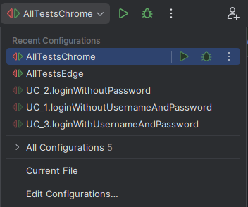
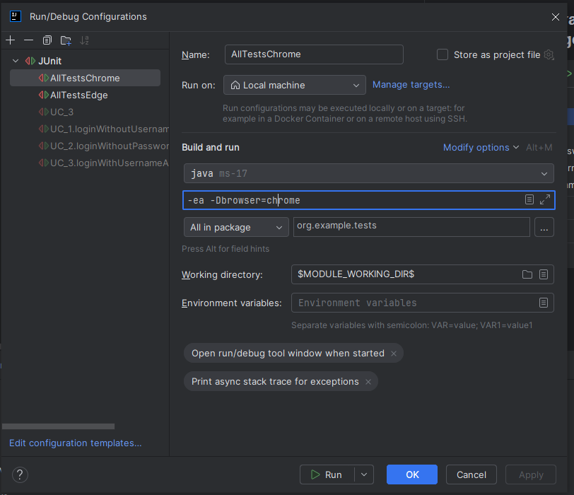

## JAVA AUTOMATION COURSE FINAL TEST

--
Set browser parameter by typing -Dbrowser="chrome" or -Dbrowser="edge" in run configuration or when launching mvn test
--

# Logger

You can browse logs inside /logs/test-log.log file or console.
--
